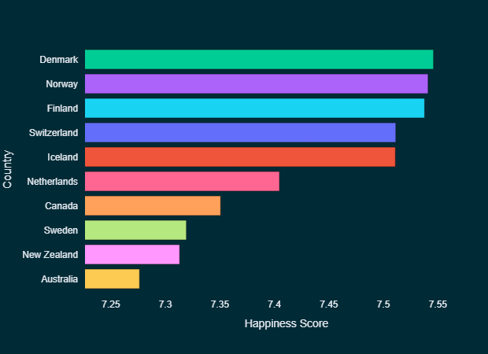
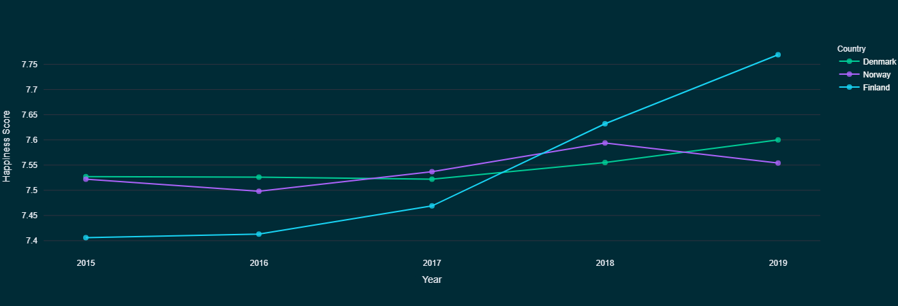
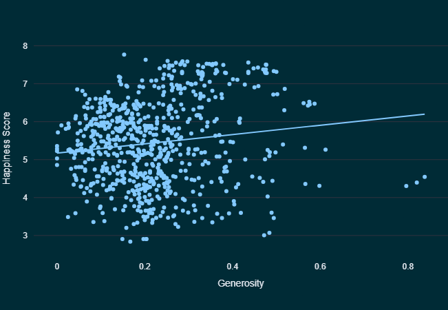
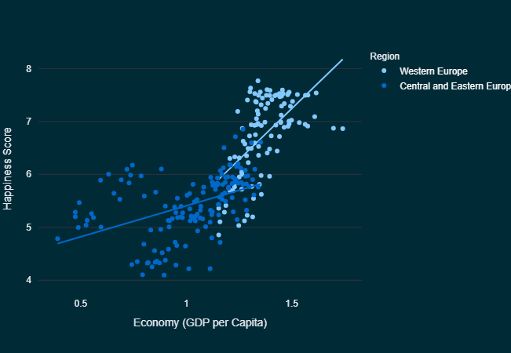
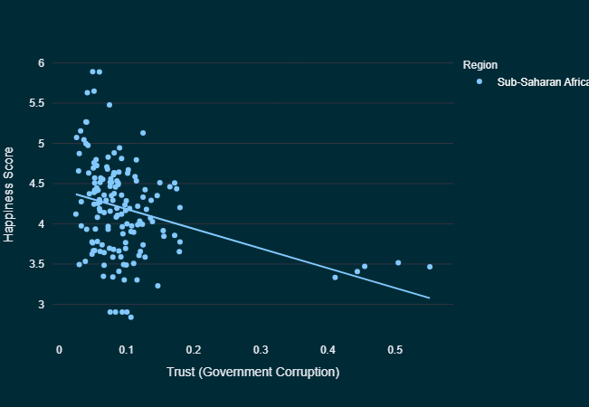

<div style="text-align: center;">
  
  <!-- <h1>🌍 World Happiness Dashboard</h1> -->
</div>

Welcome to the **World Happiness Dashboard**, an interactive Streamlit application that allows users to explore and analyze global happiness data from 2015 to 2019. 

## 📊 Explore Global Happiness Data

The goal of this dashboard is to provide insights into the World Happiness dataset, enabling users to:
- Visualize happiness scores across countries, regions, and time.
- Filter and explore data by year, region, and country.
- Analyze correlations between happiness score components.
- Gain insights into contributing factors to happiness.

## 🌟 Highlights

### 🌐 Top 10 - The Countries with Highest and Lowest Happiness Scores

The **Top 10 Page** provides insights into the happiest and least happy countries based on the World Happiness dataset. Users can:

- View the top 10 happiest countries and the bottom 10 least happy countries based on average happiness scores from 2015 to 2019.
- Explore the top 10 happiest and least happy countries for a specific year.
- Visualize the data using interactive bar charts, making it easy to compare happiness scores across countries.

This page offers a quick overview of global happiness rankings and highlights the countries at both ends of the happiness spectrum.

<div style="text-align: center;">
  
</div>

---

### 📊 Trends and Comparison

The **Trends Page** allows users to explore and compare happiness scores, rankings, and other contributing factors over the years. Users can:

- Visualize how happiness scores and rankings have changed for specific countries from 2015 to 2019.
- Compare multiple countries side-by-side to identify trends and patterns.
- Analyze the impact of contributing factors (e.g., GDP, social support, life expectancy) on happiness scores over time.

This page provides an interactive way to uncover insights and understand the dynamics of happiness across the globe.

<div style="text-align: center;">
  
</div>

---

### ✨ Contributing Factors

The **Contributing Factors Page** provides insights into the key factors that influence happiness scores across countries. Users can:

- Explore how factors such as GDP, social support, life expectancy, freedom, generosity, and corruption perception contribute to happiness scores.
- Visualize the relationships between these factors and happiness scores using scatter plots - exloring general, regional or yearly trends.
- Compare the importance of different factors across countries or regions.
- Analyze trends in contributing factors to understand their evolving impact on happiness.

This page helps users dive deeper into the underlying drivers of happiness and uncover meaningful patterns in the data.

<div style="border: 1px solid #ddd; padding: 10px; margin: 10px 0; border-radius: 5px; text-align: center;">
  <h3>Example: Generosity Correlation</h3>
  <p>
    This example highlights how the Generosity factor shows an <strong>almost horizontal trend line</strong> when analyzed against the Happiness Score, indicating a <strong>very low correlation</strong>. 
    This suggests that, in general, generosity has minimal influence on happiness levels across countries. While generosity may contribute to individual well-being, its impact on overall happiness scores appears to be less significant compared to other factors like GDP or social support.
  </p>
  
</div>


<div style="border: 1px solid #ddd; padding: 10px; margin: 10px 0; border-radius: 5px; text-align: center;">
  <h3>Example: GDP per Capita Correlation</h3>
  <p>
    This example highlights how GDP per Capita shows a <strong>stronger positive correlation</strong> with the Happiness Score in Western Europe compared to Eastern and Central Europe. 
    This suggests that economic prosperity plays a more significant role in influencing happiness levels in Western Europe, while other factors may have a greater impact in Eastern and Central Europe.
  </p>
  
</div>

<div style="border: 1px solid #ddd; padding: 10px; margin: 10px 0; border-radius: 5px; text-align: center;">
  <h3>Example: Trust and Happiness</h3>
  <p>
    In this region, there is a <strong>negative correlation</strong> between Trust (government corruption) and the Happiness Score. 
    This means that as the perception of government corruption increases (lower trust), the Happiness Score tends to decrease. 
    Conversely, regions with higher trust in government institutions generally report higher happiness levels. 
    This highlights the significant impact of governance and institutional integrity on overall happiness.
  </p>
  
</div>

## 🗃️ Dataset

The World Happiness data is  locatedin the `/app/data` folder as individual CSV files for each year (2015–2019). These files contain happiness KPIs and explanatory factors for various countries.

## 🚀 Quickstart

The dashboard is built using Streamlit, a powerful framework for creating interactive web applications in Python. The application is designed to be user-friendly and visually appealing, making it easy to explore and analyze the data.

Access the dashboard on [Streamlit](https://world-happiness-dashboard-pa-tech-lead-recr-task.streamlit.app/) or run it locally using the provided instructions.

## 🛠️ Installation

###  Python

Clone the repository and navigate to the project directory:

```bash
git clone https://github.com/georgi-alexandrov/world-happiness-dashboard
cd world-happiness-dashboard
```

with [uv](https://github.com/astral-sh/uv):

```powershell
# prepare the python enviroment
uv sync

# run the app
cd app
uv run streamlit run main.py
```

 with pip
```powershell
# Install packages
pip install -r requirements.txt

# Run the app
cd app
python -m streamlit run main.py
```

### Docker
Alternatively, you can run the application using Docker. Make sure you have Docker installed on your machine.

```bash
# Build the Docker image
docker build -t world-happiness-dashboard .

# Run the Docker container
docker run -p 8501:8501 world-happiness-dashboard
```

Docker-compose is also available. You can use the provided `docker-compose.yaml` file to run the application with Docker Compose.

```bash
# Pull and run the Docker image using Docker Compose
docker-compose up
```

Then, open your web browser and navigate to `http://localhost:8501` to access the dashboard.
